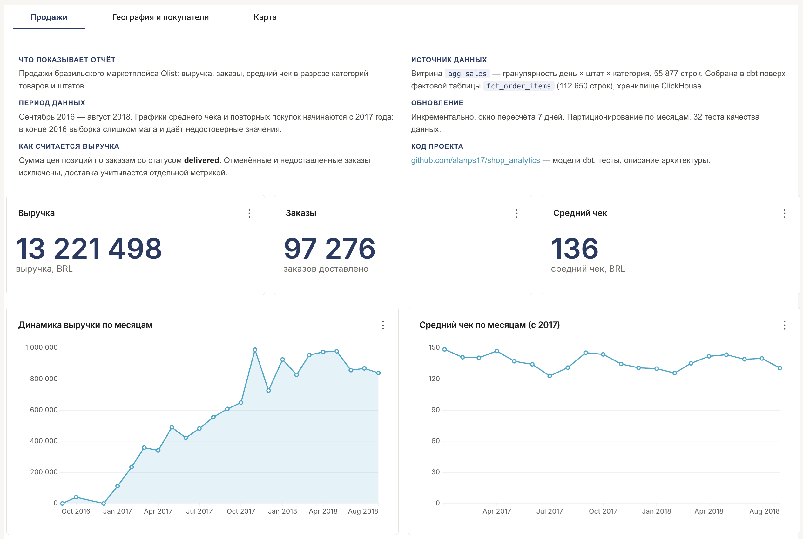
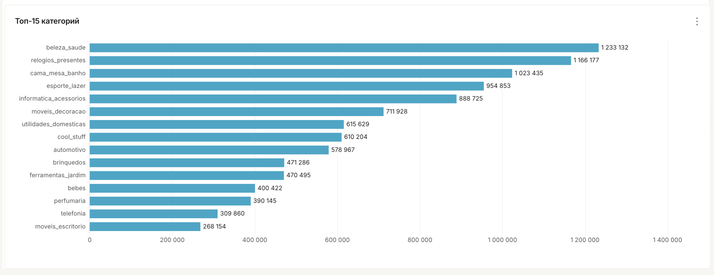
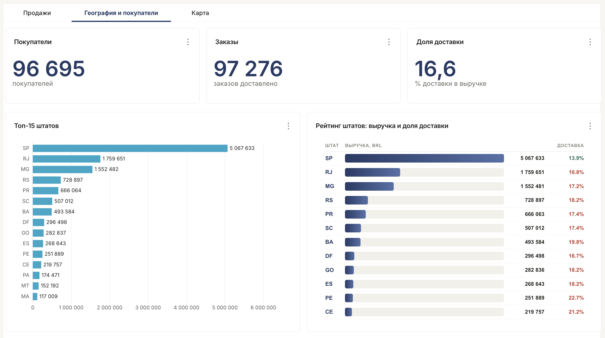
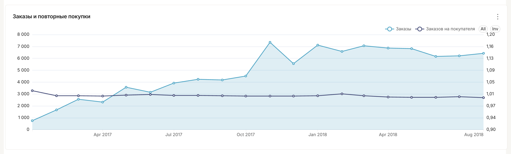
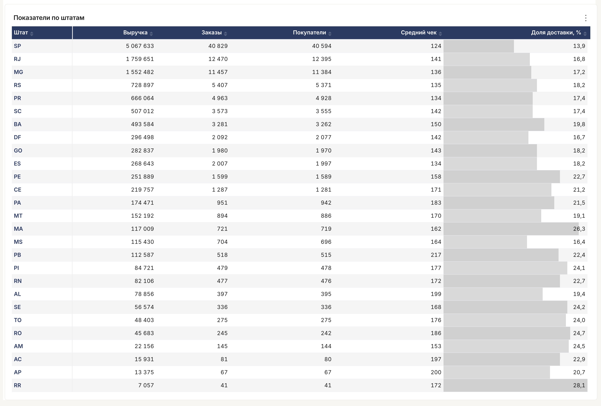
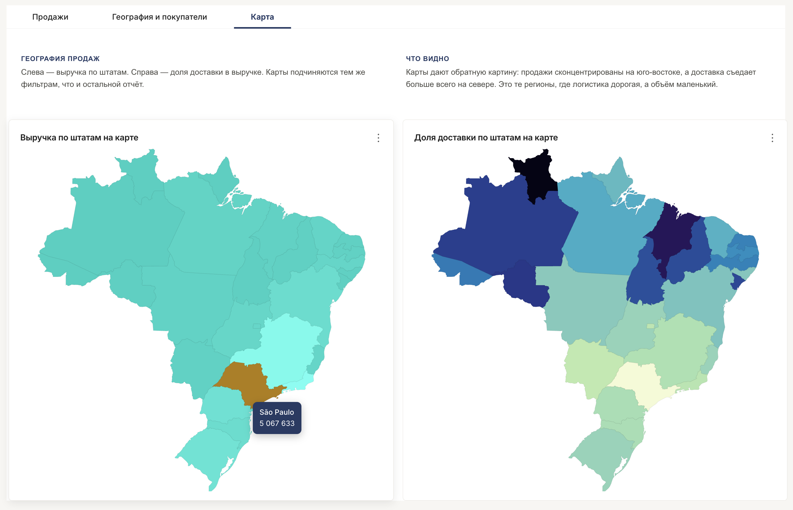
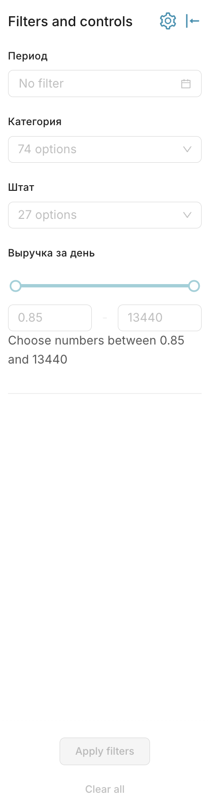

# shop_analytics

Аналитическое хранилище на данных бразильского маркетплейса Olist: от сырых CSV до дашборда с фильтрами.

**Стек:** ClickHouse · dbt-core · Apache Superset · Docker

---

## Что здесь построено

Полный конвейер данных из четырёх слоёв. Одиннадцать моделей dbt, 32 теста качества данных, инкрементальное обновление, настроенное хранение в ClickHouse и дашборд из двенадцати визуалов на трёх вкладках.

Данные: [Brazilian E-Commerce Public Dataset by Olist](https://www.kaggle.com/datasets/olistbr/brazilian-ecommerce) — 99 441 заказ, 112 650 позиций, 32 951 товар, 96 096 покупателей за 2016–2018 годы.



---

## Архитектура

```
RAW                8 таблиц Olist, загружены как есть
 │
STAGING            5 моделей · view · техническая чистка
 │                 stg_orders · stg_order_items · stg_products
 │                 stg_customers · stg_category_translation
 │
FACTS              fct_order_items · incremental · 112 650 строк
 │                 одна строка = одна позиция заказа
 │
MARTS              dim_products · dim_customers   — справочники
                   agg_sales                       — витрина под дашборд
                   agg_revenue_daily               — выручка по дням
                   agg_revenue_by_state            — выручка по штатам
```

### Что делает каждый слой

**Staging** — только техническая чистка: приведение типов, исправление имён колонок, дедупликация. Один источник = одна модель, соединений здесь нет. Слой остаётся зеркалом источника, чтобы всегда можно было сверить данные с исходником.

**Facts** — здесь впервые появляются соединения и живёт бизнес-логика. Что считать выручкой, как называется неизвестная категория — определяется один раз, и все витрины поверх наследуют это автоматически.

**Marts** — агрегаты под конкретные вопросы. Логики не содержат, только группируют и складывают.

---

## Ключевые решения

### Разделение orders и order_items

В Olist заказ и товары в заказе лежат в разных таблицах, и это не случайность: у них разная гранулярность. Строка в `orders` — это заказ, строка в `order_items` — товар внутри заказа.

Склеивать их в одну staging-модель нельзя. При соединении таблиц разной гранулярности строки размножаются (fan-out), и любая метрика уровня заказа завышается кратно числу позиций.

Поэтому staging повторяет структуру источника, а соединение происходит в фактовом слое — с проверкой, что число строк не изменилось.

### Обработка пропусков

610 товаров из 32 951 не имеют категории. Строки не удаляются: на них приходится 170 726 BRL выручки, которая иначе молча исчезла бы из отчётов и перестала сходиться с источником.

Вместо удаления пропуск делается видимым:

```sql
coalesce(nullif(product_category_name, ''), 'unknown') as category
```

`nullif` приводит пустую строку к NULL, `coalesce` заменяет все NULL на `unknown`. Связка из двух функций нужна потому, что «нет значения» приходит из CSV двумя способами — как пустая строка и как NULL.

Правило по типам колонок:

| Тип колонки | Решение | Почему |
|---|---|---|
| Текстовый атрибут для группировки | `unknown` | NULL в группировке выглядит пустотой и путает |
| Числовая мера | оставить NULL | 0 означает «ноль штук», NULL — «неизвестно»; замена исказит среднее |
| Ключ | не подменять | все строки с фиктивным ключом склеятся в один объект |

Пустые даты доставки (2 965 заказов) тоже остаются NULL — заказ просто ещё не доставлен, и это корректное состояние, а не ошибка данных.

### Хранение в ClickHouse

```sql
{{ config(
    materialized='incremental',
    engine='MergeTree()',
    order_by='(order_date, category, order_id)',
    partition_by='toYYYYMM(order_date)',
    incremental_strategy='delete+insert',
    unique_key='(order_id, order_item_id)'
) }}
```

**Ключ сортировки** начинается с даты, потому что по ней фильтруют почти в каждом запросе. Одинаковые даты лежат рядом, и ClickHouse пропускает блоки, где нужного периода заведомо нет.

**Партиционирование по месяцам** даёт 24 партиции на весь датасет — в рекомендуемых пределах. Партиционирование по полям с высокой кардинальностью (id, категория) не применяется: тысячи мелких партиций работают медленнее, чем десяток крупных.

Колонки в ключах обёрнуты в `assumeNotNull()`. ClickHouse не принимает Nullable в `ORDER BY` и `PARTITION BY`, а снимать обёртку безопасно, потому что тесты `not_null` на этих колонках проходят.

### Инкрементальное обновление

```sql

where o.order_purchase_ts >= (
    select max(order_purchase_ts) - interval 7 day
    from {{ this }}
)

```

Пересчитывается только последняя неделя вместо всей истории. Отступ на 7 дней назад нужен для данных, которые приезжают с опозданием: заказ мог быть сделан вчера, а попасть в источник сегодня. Дубли при этом не появляются — стратегия `delete+insert` затирает строки с теми же ключами.

### Две модели агрегатов

`agg_sales` — широкая витрина с тремя измерениями (день, штат, категория), 55 877 строк. Все фильтры дашборда действуют на все графики, потому что нужные колонки есть в одной таблице.

`agg_revenue_daily` и `agg_revenue_by_state` — узкие агрегаты под отдельные отчёты. Читаются быстрее за счёт меньшего объёма.

Оба подхода в проекте намеренно: широкая витрина решает задачу сквозной фильтрации, узкие — задачу скорости конкретного отчёта.

---

## Тесты

32 теста в `schema.yml`, из них два — проверки целостности связей:

```yaml
- name: product_id
  tests:
    - relationships:
        arguments:
          to: ref('dim_products')
          field: product_id
```

Тесты защищают не данные, а код: каждый слой — это новое преобразование и новое место для ошибки. Проверяются ключи, меры и атрибуты группировки — то, от чего зависит правильность отчёта.

Обязательная проверка после каждого соединения — число строк не изменилось. Рост означает дубли в справочнике и размножение данных.

---

## Дашборд

Superset 6.1.0, три вкладки, двенадцать визуалов на витрине `agg_sales`.

### Вкладка «Продажи»

Титульная карточка с описанием отчёта, периодом данных, правилом расчёта выручки и ссылкой на код. Три показателя, динамика выручки и среднего чека, топ-15 категорий.



Графики среднего чека и повторных покупок начинаются с 2017 года: в конце 2016 в данных единичные заказы, из-за которых линия падала до недостоверных значений. Обрезка вынесена в название графика, а не спрятана.

### Вкладка «География и покупатели»



Справа — рейтинг штатов на Handlebars: полосы внутри строк, ширина считается в SQL оконной функцией `max(SUM(revenue)) OVER ()`, доля доставки раскрашена по порогу. Числа форматируются разрядами тоже в SQL, а не в шаблоне — это не зависит от версии хелперов Superset.



График с двумя осями: заказы слева, коэффициент «заказов на покупателя» справа. Он держится около 1.00 — повторных покупок практически нет, 97 276 заказов на 96 695 покупателей. Отдельная ось нужна, чтобы колебания были видны: на общей шкале линия сливалась с осью.



### Вкладка «Карта»



Две карты Бразилии рядом: выручка и доля доставки. Вместе они дают вывод, которого нет по отдельности — продажи сконцентрированы на юго-востоке, а доставка съедает больше всего там, где объём минимальный.

Superset сопоставляет регионы по кодам ISO 3166-2 с префиксом страны, поэтому в поле сущности стоит `concat('BR-', state)`, а не просто колонка.

### Фильтры



Четыре сквозных фильтра: период, категория, штат, диапазон дневной выручки. Все действуют на все двенадцать визуалов, включая карты — это возможно потому, что дашборд построен на одной витрине со всеми измерениями.

Отдельные приёмы: оверлей загрузки через CSS `:has()`, кастомная палитра, лечение обрезанной подсказки на картах через точечное снятие `overflow: hidden`.

---

## Как запустить

```bash
# ClickHouse
docker run -d --name clickhouse-server \
  -p 8123:8123 -p 9000:9000 \
  -e CLICKHOUSE_PASSWORD=123 \
  clickhouse/clickhouse-server

# dbt
python -m venv ~/dbt-env
source ~/dbt-env/bin/activate
pip install dbt-core dbt-clickhouse

# Загрузить CSV Olist в ClickHouse как таблицы *_raw,
# затем собрать проект
dbt run
dbt test

# Документация и граф зависимостей
dbt docs generate
dbt docs serve
```

Данные в репозиторий не входят — скачиваются с Kaggle и кладутся в `data/raw/olist/`.

---

## Структура

```
models/
  staging/
    stg_orders.sql
    stg_order_items.sql
    stg_products.sql
    stg_customers.sql
    stg_category_translation.sql
    schema.yml
  marts/
    fct_order_items.sql
    dim_products.sql
    dim_customers.sql
    agg_sales.sql
    agg_revenue_daily.sql
    agg_revenue_by_state.sql
    schema.yml
docs/
  скриншоты дашборда
dbt_project.yml
```

---

## Что дальше

- SCD2 для справочника товаров — отслеживание изменений категорий во времени
- Оркестрация в Airflow: расписание, зависимости, уведомления при падении тестов
- Собственные тесты dbt: контроль доли `unknown`, проверка диапазонов дат
- Метрики свежести данных (`source freshness`)
